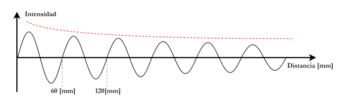
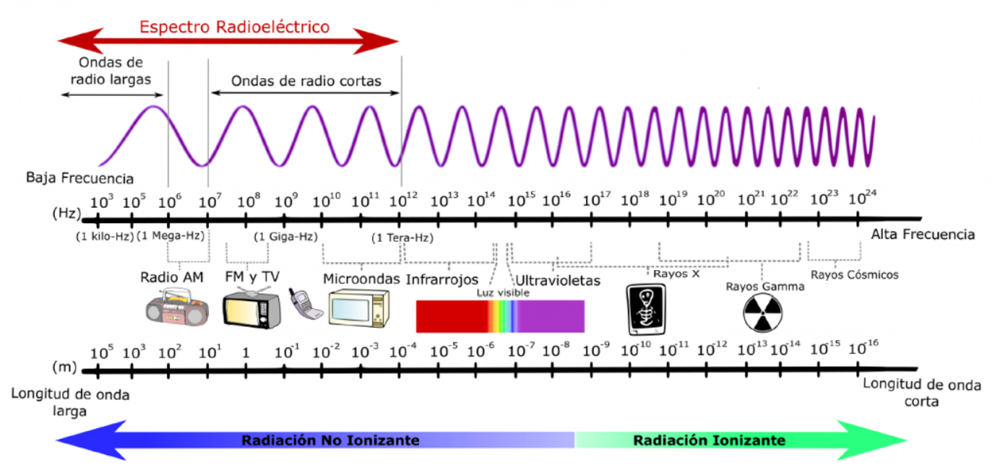
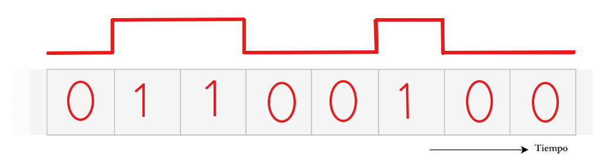
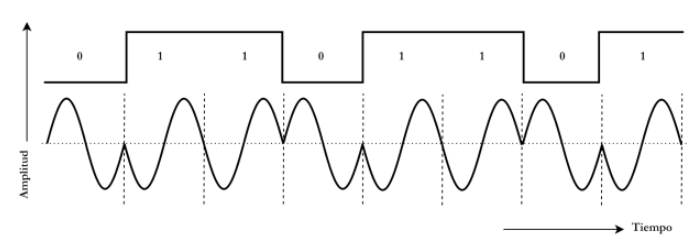
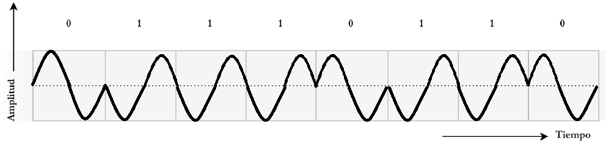
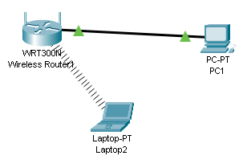
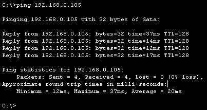
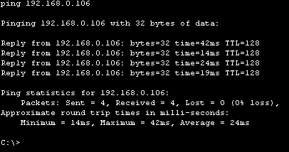
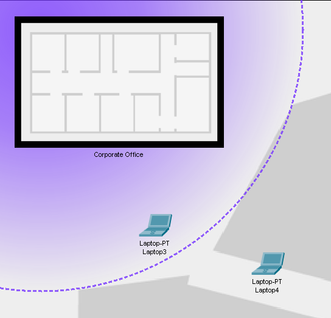
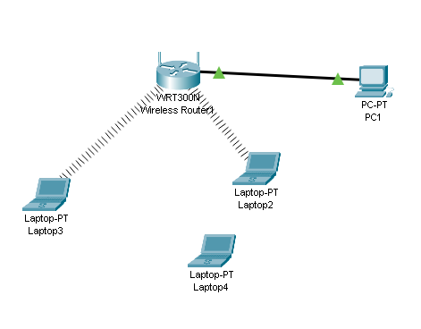

# Comunicaciones 101: Repaso de fundamentos esenciales e introducción a Packet Tracer

**Nombres**

- _Fracisco Gomez Neimann_

- _Martina Juri_

- _Maria Wanda Molina_

- _Marcos Morán_

**Nombre del grupo**

WAN_da

**Nombre del centro educativo o institución**

Facultad de Ciencias Exactas, Físicas y Naturales

**Nombre del curso o materia**

Comunicaciones de Datos

**Profesores**

Santiago M. Henn

**Fecha**

22 de agosto de 2025

---

### Información de los autores

- **Información de contacto**:

  _francisco.gomez.neimann@mi.unc.edu.ar_

  _martina.juri@mi.unc.edu.ar_

  _wanda.molina@mi.unc.edu.ar_

  _mmoran@mi.unc.edu.ar_

---

## Resumen

El presente Trabajo Práctico N°1 tiene como objetivo repasar y consolidar los conceptos fundamentales de Comunicaciones Digitales y Teoría de las Comunicaciones, estableciendo un vínculo entre la capa física y los modelos de transmisión/recepción de datos. Se abordarán temas esenciales como las ondas electromagnéticas, los procesos de modulación y demodulación, y las características de las señales de tiempo continuo y discreto.

## Introducción

El trabajo explorará la clasificación de ondas en el espectro electromagnético según la ITU, analizará el fenómeno de la atenuación y su impacto en diferentes medios de transmisión como la telefonía celular, cables coaxiales y fibra óptica. Además, se examinarán los principios de la comunicación de datos digitales, incluyendo los tipos de transmisión y las técnicas de modulación adecuadas para medios inalámbricos, junto con el concepto de Bit Error Rate (BER). Finalmente, se utilizará el simulador Packet Tracer para construir y configurar una red simple, permitiendo la aplicación práctica de los conocimientos teóricos en el diseño y análisis de redes, y la exploración de la cobertura de la señal inalámbrica.

**Palabras Clave**:

# Marco teórico / Modelo / Metodología

## Marco teórico

**1. Ondas Electromagnéticas**

Las ondas electromagnéticas son perturbaciones simultáneas de los campos eléctrico y magnético que se propagan en el espacio sin necesidad de un medio material. Se caracterizan por su frecuencia, longitud de onda, amplitud y velocidad de propagación (en el vacío, equivalente a la velocidad de la luz). Estas ondas constituyen la base de las comunicaciones inalámbricas, al permitir el transporte de información a largas distancias, como en la radio, televisión, telefonía móvil e internet.

**2. Modulación y Demodulación**

La modulación es el proceso mediante el cual una señal de información (por ejemplo, voz, audio o datos) se combina con una señal portadora de mayor frecuencia, con el fin de facilitar su transmisión y adecuarla a las características del canal. Existen diferentes técnicas de modulación, entre ellas:

**Modulación analógica:** como la modulación en amplitud (AM), frecuencia (FM) y fase (PM).

**Modulación digital:** como ASK, FSK, PSK y QAM, utilizadas en sistemas modernos.

La demodulación es el proceso inverso, a través del cual el receptor recupera la señal de información original a partir de la señal modulada. Ambas técnicas son fundamentales en cualquier sistema de comunicación.

**3. Señales de Tiempo Continuo**

Una señal de tiempo continuo es aquella definida para todo instante de tiempo. Estas señales suelen ser analógicas y describen fenómenos físicos del mundo real, tales como la variación del voltaje, la temperatura o la presión. Matemáticamente se representan como $x(t)$, donde $t$ es una variable continua. El análisis de señales de tiempo continuo permite estudiar y modelar sistemas en el dominio analógico, siendo esencial en circuitos eléctricos, acústicos y mecánicos.

**4. Señales de Tiempo Discreto**

Las señales de tiempo discreto se definen únicamente en instantes específicos o discretos de tiempo, representados matemáticamente como $x[n]$, donde $n$ es un número entero. Estas señales se obtienen a partir del proceso de muestreo de una señal de tiempo continuo. Según el teorema de muestreo de Nyquist, la frecuencia de muestreo debe ser al menos el doble de la máxima frecuencia presente en la señal original para evitar distorsiones conocidas como aliasing. Las señales discretas constituyen la base del procesamiento digital, ya que pueden almacenarse, manipularse y transmitirse en sistemas computacionales.

## Modelo

## Metodología

---

## Resultados

## 1. Onda electromagnética

### a. Análisis del gráfico

En el siguiente gráfico se ve una onda electromagnética propagándose en el eje de distancia [mm]. Es posible ver que:

- La distancia entre dos crestas consecutivas se marca como 60 mm.
- Al ser una onda electromagnética, viaja a la velocidad de la luz ($c = 3·10^8 m/s$).

Figura X: [Onda Electromagnética](https://drive.google.com/drive/u/1/folders/1VmlirVlTplG6luMhQwEFXqqF9nYieI9d)

### b. ¿Qué frecuencia y longitud de onda tiene esta onda?

Como fue mencionado anteriormente, la distancia entre dos crestas consecutivas es de 60 mm, lo cual corresponde a la longitud de onda (𝜆). Es decir:

$$λ=60 mm=0.06 m$$

Dado que la onda se propaga a la velocidad de la luz en el vacío ($c=3x10^8 m/s$), se puede calcular la frecuencia como:

$$f=\frac{c}{𝜆}=\frac{3x10^8m/s}{0.06m}=5.10^9Hz=5GHz$$

Por lo tanto, la onda tiene una longitud de onda de 60 mm y una frecuencia de 5 GHz.

### c. ¿En qué región y banda del espectro electromagnético opera esta onda?

El espectro electromagnético se divide en regiones según la frecuencia. La señal calculada posee una frecuencia de 5 GHz, la cual pertenece a la región de las microondas, comprendida entre 300 MHz y 300 GHz. Según la clasificación de la Unión Internacional de Telecomunicaciones (UIT), esta frecuencia corresponde a la banda SHF (Super High Frequency), que abarca el rango de 3 GHz a 30 GHz.
En conclusión, la onda de 5 GHz se encuentra en la región de microondas y dentro de la banda SHF.

Figura X: [Espectro electromagnetico](https://nuevaescuelamexicana.sep.gob.mx/contenido/coleccion/espectro-electromagnetico/)

### d. ¿Qué dispositivos para comunicaciones de datos operan en esta banda?

La banda de 5 GHz es utilizada ampliamente en sistemas de comunicaciones modernas. Un caso muy relevante es el de las redes inalámbricas Wi-Fi, en particular los estándares IEEE 802.11a, 802.11n, 802.11ac y 802.11ax, que operan en este rango de frecuencias. Además, también se utilizan en enlaces de microondas punto a punto, así como en algunos sistemas de radar.
Un ejemplo concreto es el Wi-Fi de 5 GHz, presente en routers domésticos y empresariales, el cual permite conexiones de alta velocidad con menor interferencia respecto a la banda de 2.4 GHz, aunque con un alcance más reducido.

### e. ¿Qué fenómeno representa la línea de trazos roja?

La línea de trazos rojos en la figura representa el fenómeno de la atenuación de la señal, es decir, la pérdida progresiva de intensidad conforme la onda se propaga en el espacio. Esto ocurre debido a que la energía de la onda se dispersa y, en ciertos medios, se disipa en forma de calor o interacciones con obstáculos. En el gráfico, la línea roja ilustra cómo la amplitud efectiva de la señal decrece con la distancia recorrida.

### f. ¿Este fenómeno afecta al dispositivo mencionado?

Sí, la atenuación afecta directamente a los dispositivos que operan en la banda de 5 GHz, como los routers Wi-Fi. En la práctica cotidiana, esto se percibe en que la señal de Wi-Fi de 5 GHz tiene menor alcance y pierde potencia rápidamente al atravesar paredes u obstáculos, en comparación con la señal de 2.4 GHz. Por ello, es habitual notar que la conexión inalámbrica se debilita o incluso se pierde en habitaciones alejadas del router.

### g. ¿Afecta este fenómeno a diferentes sistemas de transmisión?

i) **Telefonía celular:** Las transmisiones celulares también sufren atenuación. Por ello, la calidad de la señal disminuye al aumentar la distancia respecto a la antena base o al estar dentro de edificios, lo que provoca llamadas interrumpidas o menor velocidad de datos.

ii) **Transmisiones por cable coaxial:** En este caso, la atenuación también está presente, aunque en menor medida que en el aire. El efecto depende de la longitud del cable y de la frecuencia de la señal transmitida. Por este motivo, en redes de televisión por cable e internet se utilizan amplificadores para compensar las pérdidas en tramos largos.

iii) **Transmisiones por fibra óptica:** La fibra óptica presenta un nivel de atenuación muy bajo en comparación con los otros medios, lo que permite transmitir señales a largas distancias con mínima pérdida. Sin embargo, en enlaces muy extensos todavía es necesario utilizar repetidores ópticos para regenerar la señal y evitar degradaciones.

## 2. Análisis del sistema de transmisión

#### a. Tipo y modo de transmisión

El sistema representado corresponde a una transmisión serial de datos, ya que los bits se envían de manera secuencial a través de una única línea de datos.
En cuanto a la direccionalidad, el diagrama refleja un esquema simplex (unidireccional), dado que solo uno de los extremos transmite mientras el otro recibe.
Respecto a la sincronización, se observa el uso de una línea de reloj dedicada, lo cual caracteriza una transmisión síncrona, donde el receptor toma el ritmo directamente del emisor.

#### b. Evaluación del paradigma para rapidez y bidireccionalidad

Si el objetivo es transmitir datos de forma rápida y bidireccional, este no es el paradigma más adecuado.
El esquema serial síncrono simplex limita la comunicación a un único sentido por vez. Una alternativa más eficiente sería implementar full-duplex (con dos líneas de datos separadas para transmisión y recepción) o al menos half-duplex en una única línea, lo que permitiría alternar los roles de emisor y receptor. Estos modos aumentan la velocidad efectiva de intercambio y posibilitan la bidireccionalidad requerida.

#### c. Señal digital correspondiente a la 4ª letra del nombre del grupo

El nombre del grupo es WAN_da, cuya 4ª letra es “d”.
El valor ASCII de “d” es 0x64, equivalente a 01100100 en binario (8 bits).
Siguiendo la misma lógica que en el ejemplo de la consigna, la forma de onda resultante sería:

0 1 1 0 0 1 0 0

Visualmente, se representa como niveles de tensión altos (“1”) y bajos (“0”) en cada ventana temporal de bit:

Figura X: Señal digital. Fuente propia

_Nota: en este ejercicio se representa únicamente la secuencia de bits, sin agregar los bits de inicio ni de parada propios de una trama UART real._

#### d. Elección de los instantes de muestreo

Debido a que los flancos de subida y bajada de la señal no son instantáneos (presentan pendiente), el muestreo debe realizarse en el centro de cada intervalo de bit, una vez que la señal alcanzó un nivel estable.
De esta manera se evita que el receptor lea valores intermedios durante la transición.
En términos de marcas temporales, si cada ventana de bit se abre con un pulso de reloj, la medición confiable corresponde a la mitad de cada período de bit (T0, T1, T2… en sus posiciones centrales).

---

## 3. Motivos por los cuales no se transmiten señales escalonadas en forma inalámbrica y técnicas de modulación

La transmisión de señales escalonadas en forma inalámbrica no es conveniente debido a que dichas señales presentan transiciones abruptas en el dominio temporal. Estas transiciones contienen una gran cantidad de componentes de alta frecuencia cuando se analizan en el dominio espectral. En consecuencia, una señal escalonada ocuparía un ancho de banda muy amplio y sería ineficiente desde el punto de vista de la transmisión. Además, la radiación de altas frecuencias incrementa la probabilidad de interferencias y atenuaciones selectivas en el canal, dificultando la recuperación confiable de los datos en el receptor. Para solucionar este problema, se recurre a técnicas de modulación, que permiten representar la información digital sobre una portadora sinusoidal de frecuencia mucho más alta, ajustando parámetros como amplitud, frecuencia o fase.

#### a. Identificación de la técnica de modulación

La figura corresponde a una modulación por desplazamiento de fase binaria (BPSK, Binary Phase Shift Keying). En esta técnica, los bits se transmiten modificando la fase de la portadora: típicamente, un bit “0” se representa con fase de 0°, y un bit “1” con fase de 180°.

#### b. Representación de la señal modulada

Figura X: Señal digital. Fuente propia

#### c. Otras técnicas basadas en los mismos principios:

- **QPSK (Quadrature Phase Shift Keying)**: utiliza cuatro fases distintas (0°, 90°, 180°, 270°) para transmitir 2 bits por símbolo, aumentando la eficiencia espectral.

- **8-PSK, 16-PSK, etc.**: generalizaciones que emplean más fases distintas para transmitir mayor cantidad de bits por símbolo.

- **QAM (Quadrature Amplitude Modulation)**: combina variaciones de fase y amplitud, permitiendo transmitir aún más bits por símbolo.

#### d. ¿Que es el Bit Error Rate? ¿Cual de las técnicas presentadas anteriormente tiene mejores prestaciones?

El "bit error rate" **BER** es la tasa de errores en los bits recibidos, definida como la proporción de bits incorrectamente detectados respecto al total de bits transmitidos.
De las técnicas mencionadas anteriormente BPSK ofrece la mejor robustez frente al ruido, ya que solo tiene dos posibles estados de fase claramente diferenciados.

4.  Haciendo uso de el programa Cisco Packet Tracer colocamos un router configurado para operar con autenticacion WPA2-PSK con una frecuencia de 2,4GHz que se encuentra en la región de las microondas, específicamente en la Banda S del espectro electromagnético, que va de 2 a 4 GHz.
    Posteriormente conectamos los siguientes dispositivos como se puede visualizar en la siguiente imagen:
    
    A traves de pings comprobamos la conectividad de tanto la computadora de escritorio y notebook como se puede apreciar en las siguientes imagenes:
    
    
    Para testear los limites de radio de nuestra red wifi usamos la vista "física" del programa y colocamos dos nuevos dispositivos uno por dentro y el otro por fuera del radio maximo de la red generada por nuestro router e intentamos conectar:
    
    Con el dispositivo colocado por dentro hicimos la prueba de conexion con la PC principal:
    
    Finalmente las conexiones en la vista logica quedarian de la siguiente manera:
    

---

## Discusión y Conclusiones

---

## Referencias
