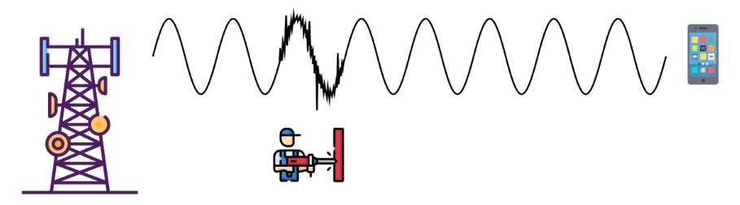

# Más conceptos fundamentales de capa física y capa de enlace de datos.

**Nombres**

- _Francisco Gomez Neimann_

- _Martina Juri_

- _Maria Wanda Molina_

- _Marcos Morán_

**Nombre del grupo**

WAN_da

**Nombre del centro educativo o institución**

Facultad de Ciencias Exactas, Físicas y Naturales

**Nombre del curso o materia**

Comunicaciones de Datos

**Profesores**

Santiago M. Henn

**Fecha**

06 de septiembre de 2025

---

### Información de los autores

- **Información de contacto**:

  _francisco.gomez.neimann@mi.unc.edu.ar_

  _martina.juri@mi.unc.edu.ar_

  _wanda.molina@mi.unc.edu.ar_

  _mmoran@mi.unc.edu.ar_

---
## Resumen
El Trabajo Práctico N°2 tiene como objetivo consolidar y expandir los conocimientos en las capas más fundamentales de las redes de computadoras: la Capa Física y la Capa de Enlace de Datos. Además de los conceptos teóricos, el trabajo introduce una herramienta práctica esencial para el análisis de redes, WireShark, y fomenta la familiarización con su uso.

## Introduccion

**Palabras Clave**

## Marco teórico

---

## Resultados
### 1. Fenómeno físico representado y sus características (a)
a. El fenómeno representado en la figura es el efecto Doppler, que consiste en la variación aparente de la frecuencia de la señal debido al movimiento relativo entre el emisor y el receptor.

#### Características del Efecto Doppler
- **Sentido del movimiento:** Si el emisor y el receptor se acercan, la frecuencia recibida aumenta, comprimiendo las ondas. Por el contrario, si se alejan, la frecuencia recibida disminuye, expandiendo las ondas.
- **Ocurrencia en comunicaciones inalámbricas:** ocurren en sistemas de radio, celular, WiFi y comunicaciones satelitales debido al movimiento de satelites, aviones, vehiculos o usuarios.
- **Magnitud de desplazamiento:** depende de la velocidad relatica entre transmisor y receptor y de la freceucnia de la portadora. A mayor frecuencia, mayor impactor de Doppler.

### 2. Fenómeno físico representado y sus características (b)

a. El fenomeno representado en la figura es la interferencia o ruido en la señal durante la transmisión. La señal inicialmente limpia se ve distorsionada en cierto tramo (ruido o perturbación). Esto puede deberse a fenómenos como:

- **Ruido electromagnético:** Introducido por otras fuentes de energía eléctrica o radiación.
- **Desvanecimiento (fading):** Variaciones en la amplitud y fase de la señal debido a obstáculos, reflexión o dispersión multipath.

#### Características principales del fenómeno

- Se manifiesta como distorsión o “picos” en la señal original.
- Es aleatorio y puede variar en el tiempo y espacio.
- Afecta la calidad de la señal recibida y puede degradar la información transmitida.

En la figura, el operario con la pistola representa la introducción de ruido o interferencia durante la transmisión.

b. Bandas de transmisión y susceptibilidad

Recordando las bandas vistas en TP01:

- **Baja frecuencia (LF, MF, HF):** Menos afectadas por desvanecimiento rápido; penetran obstáculos mejor.
- **Alta frecuencia (VHF, UHF, SHF, EHF):** Más susceptibles a interferencias y desvanecimiento multipath, especialmente microondas y comunicaciones móviles.

#### Conclusión:
Afecta más: Transmisiones de alta frecuencia (por ejemplo, celular, Wi-Fi, microondas).
Más resilientes: Transmisiones de baja frecuencia, por ejemplo AM de radio, que pueden atravesar obstáculos con menor degradación.

c. SNR y relación con BER

**SNR (Signal-to-Noise Ratio):** Es la relación entre la potencia de la señal útil y la potencia del ruido.
- Se mide en decibelios (dB).
- Una SNR alta indica que la señal es mucho más fuerte que el ruido → mejor calidad de transmisión.
- Una SNR baja indica que el ruido domina → mayor probabilidad de errores.

**BER:** Proporción de bits erróneos recibidos respecto a los transmitidos.

Relación con BER (Bit Error Rate):
- Si la SNR disminuye, la probabilidad de que los bits se interpreten mal aumenta → BER alta.
- Por lo tanto, SNR y BER están directamente relacionados: mayor SNR → menor BER y viceversa.

### 4. Reflexiones finales y conclusiones

El análisis con Wireshark mostró que la dirección MAC funciona como un identificador único de la tarjeta de red y, aunque no se transmite a través de Internet, sí es visible en la red local. Esto implica que otros equipos o el propio router pueden reconocer y seguir la actividad de un dispositivo, e incluso identificar su fabricante a partir del **OUI**. Por lo tanto, la privacidad del usuario dentro de una LAN es limitada: la MAC permite rastrear y asociar la presencia del dispositivo en el tiempo, lo que representa un punto crítico en la trazabilidad y en la exposición de datos en entornos compartidos.

*Similitudes entre el IMEI y la dirección MAC.*

El **IMEI** (International Mobile Equipment Identity) es un número único de 15 dígitos asignado a cada dispositivo móvil. Se utiliza para identificar y autenticar el dispositivo en la red móvil. Es crucial para la seguridad, ya que permite a los operadores bloquear dispositivos robados o perdidos, evitando su uso en la red.

La **dirección MAC** (Media Access Control) es también un identificador único, pero aplicado a las interfaces de red (Wi-Fi, Bluetooth, Ethernet). Está grabada en la tarjeta de red del dispositivo y sirve para que las redes lo reconozcan dentro de una LAN o en conexiones inalámbricas.

Son similares en varios aspectos:
- Ambos son identificadores únicos a nivel de hardware.
- Se asignan por el fabricante y no cambian al reiniciar o reinstalar software.
- Permiten identificar y controlar el acceso de un dispositivo a una red (IMEI en redes móviles; MAC en redes locales).

*¿Una VPN oculta la dirección MAC del dispositivo?*

Una **VPN** no oculta la dirección **MAC** del dispositivo, porque la MAC es un identificador físico grabado en la tarjeta de red y solo se utiliza dentro de la red local para que el router sepa a qué equipo entregar los datos, lo que realmente hace la VPN es cifrar el tráfico y reemplazar la dirección IP pública por la del servidor remoto, de modo que los sitios web o servicios externos solo ven esa IP de la VPN y no la de la conexión real, mientras que la MAC sigue siendo visible únicamente para la red local o el proveedor de Internet.
