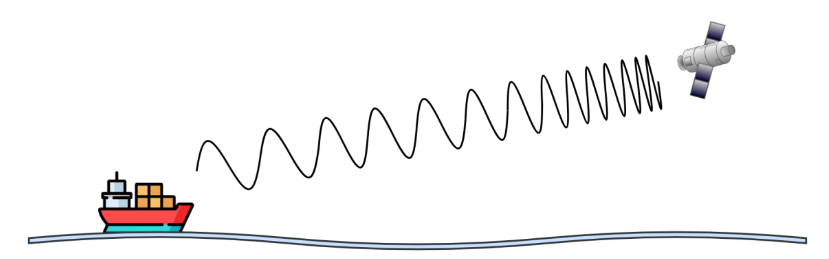

# Más conceptos fundamentales de capa física y capa de enlace de datos.

**Nombres**

- _Francisco Gomez Neimann_

- _Martina Juri_

- _Maria Wanda Molina_

- _Marcos Morán_

**Nombre del grupo**

WAN_da

**Nombre del centro educativo o institución**

Facultad de Ciencias Exactas, Físicas y Naturales

**Nombre del curso o materia**

Comunicaciones de Datos

**Profesores**

Santiago M. Henn

**Fecha**

06 de septiembre de 2025

---

### Información de los autores

- **Información de contacto**:

  _francisco.gomez.neimann@mi.unc.edu.ar_

  _martina.juri@mi.unc.edu.ar_

  _wanda.molina@mi.unc.edu.ar_

  _mmoran@mi.unc.edu.ar_

---
## Resumen
El Trabajo Práctico N°2 tiene como objetivo consolidar y expandir los conocimientos en las capas más fundamentales de las redes de computadoras: la Capa Física y la Capa de Enlace de Datos. Además de los conceptos teóricos, el trabajo introduce una herramienta práctica esencial para el análisis de redes, WireShark, y fomenta la familiarización con su uso.

## Introduccion

**Palabras Clave**

## Marco teórico

---

## Resultados
### 1. Fenómeno físico representado y sus características
a. El fenómeno representado en la figura es el efecto Doppler, que consiste en la variación aparente de la frecuencia de la señal debido al movimiento relativo entre el emisor y el receptor.

#### Características del Efecto Doppler
- **Sentido del movimiento:** Si el emisor y el receptor se acercan, la frecuencia recibida aumenta, comprimiendo las ondas. Por el contrario, si se alejan, la frecuencia recibida disminuye, expandiendo las ondas.
- **Ocurrencia en comunicaciones inalámbricas:** ocurren en sistemas de radio, celular, WiFi y comunicaciones satelitales debido al movimiento de satelites, aviones, vehiculos o usuarios.
- **Magnitud de desplazamiento:** depende de la velocidad relatica entre transmisor y receptor y de la freceucnia de la portadora. A mayor frecuencia, mayor impactor de Doppler.

### 2. 