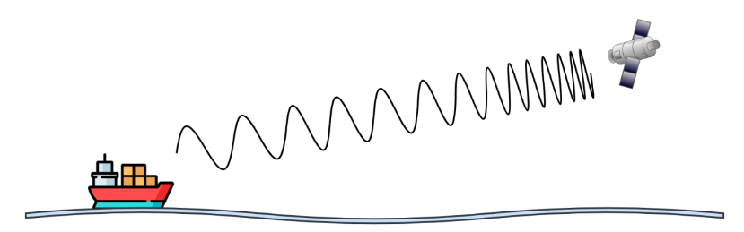
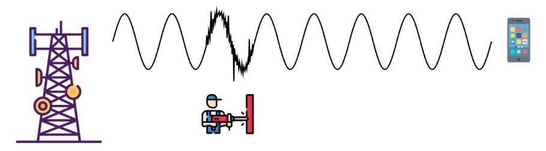
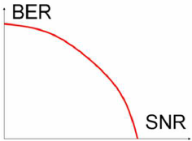

# Más conceptos fundamentales de capa física y capa de enlace de datos.

**Nombres**

- _Francisco Gomez Neimann_

- _Martina Juri_

- _Maria Wanda Molina_

- _Marcos Morán_

**Nombre del grupo**

WAN_da

**Nombre del centro educativo o institución**

Facultad de Ciencias Exactas, Físicas y Naturales

**Nombre del curso o materia**

Comunicaciones de Datos

**Profesores**

Santiago M. Henn

**Fecha**

06 de septiembre de 2025

---

### Información de los autores

- **Información de contacto**:

  _francisco.gomez.neimann@mi.unc.edu.ar_

  _martina.juri@mi.unc.edu.ar_

  _wanda.molina@mi.unc.edu.ar_

  _mmoran@mi.unc.edu.ar_

---
## Resumen

El trabajo práctico N°2 tiene como objetivo consolidar y expandir los conocimientos en las capas más fundamentales de las redes de computadoras: la Capa Física y la Capa de Enlace de Datos. Además de los conceptos teóricos, el trabajo introduce una herramienta práctica esencial para el análisis de redes, WireShark, y fomenta la familiarización con su uso.

## Introducción

En el presente trabajo práctico se abordan conceptos fundamentales relacionados con la capa física y la capa de enlace de datos dentro del modelo de referencia OSI. Se busca comprender fenómenos físicos que afectan la transmisión de señales, tales como el efecto Doppler, la atenuación y la relación señal-ruido, y analizar cómo influyen en la calidad de la comunicación.

Asimismo, se introduce la herramienta Wireshark, un analizador de protocolos que permite observar y estudiar el tráfico de red en tiempo real. De este modo, los ejercicios propuestos integran tanto el estudio teórico de los fenómenos de transmisión como la aplicación práctica en el análisis de tramas de datos y protocolos de red.

**Palabras Clave**

## Marco teórico

### Capa Física

La capa física del modelo OSI se encarga de la transmisión de bits a través de un medio físico, ya sea guiado (cableado) o no guiado (inalámbrico). Sus funciones incluyen la codificación de la señal, la modulación, la sincronización y la definición de las características eléctricas, ópticas o radioeléctricas del medio. Dentro de esta capa se analizan fenómenos como:

- **Efecto Doppler**: variación aparente de la frecuencia de una onda debido al movimiento relativo entre transmisor y receptor. Tiene especial impacto en comunicaciones móviles y satelitales.

- **Atenuación**: pérdida de potencia de la señal a medida que se propaga por el medio.

- **Ruido e interferencia electromagnética**: perturbaciones externas que afectan la calidad de la señal.

- **Relación Señal-Ruido (SNR)**: indicador que mide la proporción entre la potencia de la señal y el ruido presente en el canal.

### Capa de Enlace de Datos

La capa de enlace se sitúa sobre la capa física y tiene como función principal garantizar una comunicación libre de errores entre nodos adyacentes. Sus principales tareas son:

- *Encapsulación de tramas*: organización de la información en bloques con cabecera y control de errores.

- *Detección y corrección de errores*: a través de mecanismos como CRC o bits de paridad.

- *Control de flujo*: coordinación entre emisor y receptor para evitar pérdidas de datos.

- *Direccionamiento físico*: mediante el uso de direcciones MAC únicas para cada dispositivo.

### Wireshark

Wireshark es una herramienta de software que permite capturar, visualizar y analizar paquetes de red en tiempo real. Es fundamental para estudiar cómo se estructuran las tramas, qué protocolos intervienen y cómo se comporta el tráfico en diferentes escenarios. Entre sus utilidades se encuentran:

- Filtrado de paquetes por direcciones IP o protocolos.

- Visualización de tramas Ethernet, IP y TCP/UDP.

- Exportación y documentación de capturas para su análisis posterior.
---

## Resultados
### 1. Fenómeno físico representado y sus características (a)
a. El fenómeno representado es el efecto Doppler, que consiste en la variación aparente de la frecuencia de una onda debido al movimiento relativo entre el transmisor y el receptor.
Sus características principales son:

- La frecuencia recibida aumenta cuando emisor y receptor se acercan, y disminuye cuando se alejan.

- La magnitud del desplazamiento depende de la velocidad relativa y de la frecuencia de la portadora (a mayor frecuencia, mayor efecto Doppler).

- Tiene especial relevancia en comunicaciones satelitales y sistemas móviles, donde hay desplazamiento constante.

- Puede dificultar la demodulación de la señal y aumentar la tasa de error, por lo que los sistemas aplican compensación de Doppler para garantizar la correcta recepción.

Figura 1.1: [Efecto Doppler](https://drive.google.com/drive/u/0/folders/1VmlirVlTplG6luMhQwEFXqqF9nYieI9d)

b. Los tipos de transmisión más afectados son:
- Transmisiones analógicas y de banda angosta, donde un pqeueño cambio de frecuencia altera significativamente la señal.
- Comunicaciones de alta freceucnia, ya que el desplazamiento Dopple es proporcional a la frecuencia portadora.
- Sistemas moviles terrestres: telefonía celular, enlaces entre estaciones base y dsipositivos en movimiento rápido.

Las transmisiones mas resilientes son: 
- Señales digitales de banda ancha (OFDM, como LTE o WiFi), que toleran mejor los pequeños desplazamientos de frecuencia.
- Fibra óptica: no se ve afectado al ser un medio guiado.
- Satelites geoestacionarios, ya que suposicion relativa respecto a la Tierra es fija, minimizando el Doppler.

c. Se recomienda utilizar el modo avion cuando se esta a bordo de un avión debido a la interferencia electromagnética emitida por los celulares. Emiten en multiples bandas de freceuncia que pueden afectar la instrumentación de navegacion y comunicación del avión. Ademas, a gran altura, el celular intenta conectarse a varias antenas terrestres a la vez, lo que incrementa la potencia de transmision y el riesgo de interferencia. 
En relación con el efecto Doppler, existe un vínculo entre la restricción de utilizar el celular en el avión y éste fenómeno. El movimiento de un avión a alta velocidad genera un desplazamiento Doppler significativo en las señales del celulcar, lo que puede producir errores de frecuencia e inestabilidad en las comunicacion. Esto, sumado a la posibilidad de interferencia con los sistemas de a bordo, refuerza la restricción.

---

### 2. Fenómeno físico representado y sus características (b)

a. El fenomeno representado en la figura es la interferencia o ruido en la señal durante la transmisión. La señal inicialmente limpia se ve distorsionada en cierto tramo (ruido o perturbación). Esto puede deberse a fenómenos como:

- **Ruido electromagnético:** Introducido por otras fuentes de energía eléctrica o radiación.
- **Desvanecimiento (fading):** Variaciones en la amplitud y fase de la señal debido a obstáculos, reflexión o dispersión multipath.

Figura 2.1: [Ruido en transminsión de señal](https://drive.google.com/drive/u/0/folders/1VmlirVlTplG6luMhQwEFXqqF9nYieI9d)

#### Características principales del fenómeno

- Se manifiesta como distorsión o “picos” en la señal original.
- Es aleatorio y puede variar en el tiempo y espacio.
- Afecta la calidad de la señal recibida y puede degradar la información transmitida.

En la figura, el operario con la pistola representa la introducción de ruido o interferencia durante la transmisión.

b. Bandas de transmisión y susceptibilidad

Recordando las bandas vistas en TP01:

- **Baja frecuencia (LF, MF, HF):** Menos afectadas por desvanecimiento rápido; penetran obstáculos mejor.
- **Alta frecuencia (VHF, UHF, SHF, EHF):** Más susceptibles a interferencias y desvanecimiento multipath, especialmente microondas y comunicaciones móviles.

#### Conclusión:
Afecta más: Transmisiones de alta frecuencia (por ejemplo, celular, Wi-Fi, microondas).
Más resilientes: Transmisiones de baja frecuencia, por ejemplo AM de radio, que pueden atravesar obstáculos con menor degradación.

c. SNR y relación con BER

**SNR (Signal-to-Noise Ratio):** Es la relación entre la potencia de la señal útil y la potencia del ruido.
- Se mide en decibelios (dB).
- Una SNR alta indica que la señal es mucho más fuerte que el ruido → mejor calidad de transmisión.
- Una SNR baja indica que el ruido domina → mayor probabilidad de errores.

**BER:** Proporción de bits erróneos recibidos respecto a los transmitidos.

Relación con BER (Bit Error Rate):
- Si la SNR disminuye, la probabilidad de que los bits se interpreten mal aumenta → BER alta.
- Por lo tanto, SNR y BER están directamente relacionados: mayor SNR → menor BER y viceversa.

### 4. Reflexiones finales y conclusiones

El análisis con Wireshark mostró que la dirección MAC funciona como un identificador único de la tarjeta de red y, aunque no se transmite a través de Internet, sí es visible en la red local. Esto implica que otros equipos o el propio router pueden reconocer y seguir la actividad de un dispositivo, e incluso identificar su fabricante a partir del **OUI**. Por lo tanto, la privacidad del usuario dentro de una LAN es limitada: la MAC permite rastrear y asociar la presencia del dispositivo en el tiempo, lo que representa un punto crítico en la trazabilidad y en la exposición de datos en entornos compartidos.

*Similitudes entre el IMEI y la dirección MAC.*

El **IMEI** (International Mobile Equipment Identity) es un número único de 15 dígitos asignado a cada dispositivo móvil. Se utiliza para identificar y autenticar el dispositivo en la red móvil. Es crucial para la seguridad, ya que permite a los operadores bloquear dispositivos robados o perdidos, evitando su uso en la red.

La **dirección MAC** (Media Access Control) es también un identificador único, pero aplicado a las interfaces de red (Wi-Fi, Bluetooth, Ethernet). Está grabada en la tarjeta de red del dispositivo y sirve para que las redes lo reconozcan dentro de una LAN o en conexiones inalámbricas.

Son similares en varios aspectos:
- Ambos son identificadores únicos a nivel de hardware.
- Se asignan por el fabricante y no cambian al reiniciar o reinstalar software.
- Permiten identificar y controlar el acceso de un dispositivo a una red (IMEI en redes móviles; MAC en redes locales).

*¿Una VPN oculta la dirección MAC del dispositivo?*

Una **VPN** no oculta la dirección **MAC** del dispositivo, porque la MAC es un identificador físico grabado en la tarjeta de red y solo se utiliza dentro de la red local para que el router sepa a qué equipo entregar los datos, lo que realmente hace la VPN es cifrar el tráfico y reemplazar la dirección IP pública por la del servidor remoto, de modo que los sitios web o servicios externos solo ven esa IP de la VPN y no la de la conexión real, mientras que la MAC sigue siendo visible únicamente para la red local o el proveedor de Internet.
