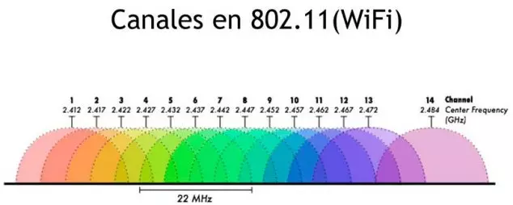

# Capas de Acceso en Redes Locales, Protocolos y Fundamentos

#### **Nombres**

- _Francisco Gomez Neimann_

- _Martina Juri_

- _Maria Wanda Molina_

- _Marcos Morán_

#### **Nombre del grupo**

WAN_da

#### **Nombre del centro educativo o institución**

Facultad de Ciencias Exactas, Físicas y Naturales

#### **Nombre del curso o materia**

Comunicaciones de Datos

#### **Profesores**

Santiago M. Henn

#### **Fecha**

22 de septiembre de 2025

---

### Información de los autores

- **Información de contacto**:

  _francisco.gomez.neimann@mi.unc.edu.ar_

  _martina.juri@mi.unc.edu.ar_

  _wanda.molina@mi.unc.edu.ar_

  _mmoran@mi.unc.edu.ar_

---
## Resumen

En este trabajo se estudiará la evolución de los métodos de transmisión de datos y el rol de la IEEE en la estandarización de tecnologías de red. Se abordarán los estándares IEEE 802.3 (Ethernet) y IEEE 802.11 (Wi-Fi), identificando sus campos de aplicación y principales características. Además, se analizarán aspectos prácticos como la compatibilidad entre dispositivos y protocolos, la relación entre seguridad y versiones de Wi-Fi, y la clasificación de las versiones más recientes de estos protocolos (Wi-Fi 5, 6 y 7). Finalmente, se vincularán estos conceptos con otras tecnologías de comunicación, destacando la importancia de las capas de acceso en redes locales.

## Introducción

Las redes de datos constituyen hoy en día la base de la comunicación digital, permitiendo la interconexión de dispositivos, personas y servicios en todo el mundo. Sin embargo, ¿cómo logramos que sistemas tan diversos hablen un mismo “idioma” y mantengan la compatibilidad a lo largo del tiempo?  

En este trabajo práctico se abordará la evolución de los estándares definidos por el **IEEE**, en particular **IEEE 802.3 (Ethernet)** y **IEEE 802.11 (Wi-Fi)**, que han sido fundamentales para el desarrollo de las redes cableadas e inalámbricas. Se analizarán sus características, compatibilidad, seguridad y las últimas versiones en uso (Wi-Fi 5/6/7), buscando comprender cómo las decisiones de estandarización influyen directamente en la calidad y seguridad de las comunicaciones actuales.

**Palabras Clave**

## Marco teórico

### IEEE 802.3 y IEEE 802.11 — Historia y campo de aplicación

#### IEEE 802.3 (Ethernet)

- En 1983, el estándar Ethernet fue adoptado oficialmente como parte del proyecto IEEE 802 del comité LAN/MAN (Local Area/Metropolitan Area Networks) del IEEE.  
- A lo largo de los años, el estándar ha evolucionado a través de múltiples enmiendas para soportar distintas velocidades físicas de transmisión, distintos medios físicos (cable coaxial, par trenzado, fibra óptica), diferentes longitudes de segmento, y mejoras en fiabilidad y eficiencia.  
- Actualmente, IEEE 802.3 es el estándar de facto para redes locales cableadas (LAN) y para muchas infraestructuras de backbone, centros de datos, conexiones de servidores, equipos de red, etc. Su campo de aplicación va desde redes hogareñas hasta campus universitarios y grandes corporaciones.  

#### IEEE 802.11 (Wi-Fi)

- IEEE 802.11 es el grupo de trabajo del IEEE para redes inalámbricas de área local (Wireless LAN). Fue uno de los primeros estándares del proyecto IEEE 802, creado para definir cómo se transmite información inalámbricamente en LANs.  
- Desde su primera versión (1997) ha habido múltiples revisiones y enmiendas: 802.11b, a, g, n, ac, ax, be, etc., cada versión agregando mejoras en velocidad, eficiencia espectral, manejo de interferencia, rango, bandas de frecuencia, etc.  
- Su campo de aplicación es toda red que necesite transmitir datos sin cables: redes domésticas, redes universitarias, oficinas, dispositivos móviles, IoT, espacios públicos, etc. Esencialmente permite conectividad inalámbrica dentro de un área cubierta por puntos de acceso (APs).

Figura 1.1: [Distribución de canales en la banda de 2.4 GHz para IEEE 802.11](https://www.adslzone.net/reportajes/wifi/canales-wifi/)

### ¿Qué sucede si una red Wi-Fi opera con determinado protocolo y un dispositivo viejo no lo soporta?

Cuando la red Wi-Fi está configurada para operar con una versión de protocolo determinada (por ejemplo IEEE 802.11ac o 802.11ax), pero un dispositivo (ej. una notebook vieja) solo tiene soporte para versiones anteriores (ej. 802.11b/g/n), ocurren varios posibles escenarios:

- Si la red y el punto de acceso (AP) tienen soporte **retrocompatible** (“backward compatibility”), el dispositivo viejo se conectará usando la versión más antigua común entre lo que la red/AP soporta y lo que el dispositivo puede usar. Por ejemplo, si la red soporta 802.11ac y también modo 802.11n/g, el dispositivo que solo tiene 802.11n se conectará mediante 802.11n.  
- Si no hay compatibilidad (por ejemplo, la red fue configurada para **rechazar** conexiones con versiones antiguas, o el dispositivo no soporta las bandas usadas), el dispositivo **no podrá conectarse**.  
- La velocidad, el rendimiento y la estabilidad estarán limitados a lo que el dispositivo antiguo pueda manejar: menor tasa de datos, mayor latencia, posiblemente mayor pérdida de paquete o degradación si la señal es débil.

### Cuadro comparativo

| Característica            | Wi-Fi 5                   | Wi-Fi 6                     | Wi-Fi 7                         |
|---------------------------|----------------------------|-------------------------------|----------------------------------|
| Versión IEEE              | IEEE 802.11ac™              | IEEE 802.11ax™                | IEEE 802.11be™ (enmienda de 802.11) |
| Tasa de datos máxima      | Alrededor de **3.5 Gbit/s** teóricos bajo condiciones ideales. | Hasta cerca de **9.6 Gbit/s** según IEEE. | Objetivo de ~**46 Gbit/s** teóricos; según IEEE 802.11be documentos recientes. |
| Banda(s)                   | Principalmente **5 GHz**  | 2.4 GHz y 5 GHz (y extensión a 6 GHz en algunos casos) | 2.4 GHz, 5 GHz, **6 GHz** y mejoras en multi-link operación; también soporte para bandas no licenciadas hasta 7.25 GHz en algunos sub-7.25 GHz. |
| Ancho de banda de canal   | Hasta **160 MHz**          | Hasta **160 MHz**, con posibilidades de combinación de canales (ej. 80+80 MHz) para mejorar rendimiento en ciertos contextos.  | Puede llegar a **320 MHz** de ancho de canal.  |
| Modulación                | Uso de OFDM, hasta **256-QAM** en Wi-Fi 5.  | Mejora con **1024-QAM**, eficiencia espectral mayor.  | Se espera uso de modulación de mayor orden aún (≥ 4096-QAM) como parte de mejoras de capacidad.  |
| Sistema de seguridad       | WPA2 (WPA2-Personal / WPA2-Enterprise) es lo usual con Wi-Fi 5. | Introduce soporte más extendido para WPA3, mejoras en autenticación, mejores protecciones frente a ataques modernos.  | Continuación de WPA3; mejoras inherentes al estándar nuevo, con mejores mecanismos de seguridad y compatibilidad hacia atrás.  |

Tabla 1: Cuadro comparativo Wi-Fi 5 / Wi-Fi 6 / Wi-Fi 7

Figura 1.2: [Evolución de los estándares Wi-Fi según IEEE 802.11](https://www.arrow.com/es-mx/research-and-events/articles/the-evolution-of-wi-fi-technologies-wi-fi-7)

## Resultados

### 1. Versión del protocolo 802.11 en redes abiertas de la Facultad

Para este apartado se realizó la prueba de conexión a la red **UNC-LIBRE**.  
A través de las herramientas de diagnóstico de Windows se determinó que la red utiliza el protocolo **Wi-Fi 6 (IEEE 802.11ax)**, operando en la **banda de 5 GHz**.  

Este resultado refleja que la infraestructura de la Facultad ya cuenta con un estándar moderno de comunicación inalámbrica. Wi-Fi 6 mejora la eficiencia en entornos con alta densidad de usuarios, aumenta la capacidad total de la red y soporta mayores velocidades respecto a versiones anteriores como Wi-Fi 5 (802.11ac) o Wi-Fi 4 (802.11n).

Figura 1.3: Información de la red WiFi "unc-libre" (Fuente Propia)

El estándar IEEE 802.11 incorpora en cada generación mejoras tanto en velocidad como en seguridad. Sin embargo, en este caso se observa que la red **UNC-LIBRE** utiliza tipo de seguridad **Abierto (sin cifrado)**.  

Esto significa que las comunicaciones entre el dispositivo y el punto de acceso **no están protegidas mediante autenticación ni cifrado**, lo que expone al tráfico a riesgos de interceptación.  

Comparando con otras opciones de seguridad:  
- **WPA2** (introducido con 802.11i) emplea cifrado AES-CCMP, garantizando confidencialidad básica.  
- **WPA3** (asociado a Wi-Fi 6 y posteriores) agrega mejoras como autenticación robusta mediante SAE y cifrado individualizado para cada sesión.  

Por lo tanto, aunque la red **UNC-LIBRE** emplea un protocolo moderno en la capa física (802.11ax), el hecho de estar abierta reduce significativamente el nivel de protección para los usuarios.

**Tabla comparativa de sistemas de seguridad en Wi-Fi:**

| Sistema de seguridad | Año de introducción | Características principales | Vulnerabilidades / Limitaciones |
|-----------------------|---------------------|-----------------------------|---------------------------------|
| **WEP (Wired Equivalent Privacy)** | 1997 (IEEE 802.11 original) | Primer intento de seguridad en Wi-Fi, basado en RC4 y claves estáticas. | Muy inseguro, fácilmente vulnerable a ataques de descifrado; obsoleto. |
| **WPA (Wi-Fi Protected Access)** | 2003 (transición) | Mejora sobre WEP con TKIP (Temporal Key Integrity Protocol). | Solo parche temporal; aún vulnerable a ataques modernos. |
| **WPA2** | 2004 (IEEE 802.11i) | Introduce AES-CCMP, más robusto que TKIP; ampliamente adoptado en la industria. | Vulnerable a ataques como KRACK; depende de configuraciones seguras. |
| **WPA3** | 2018 (Wi-Fi Alliance, compatible con IEEE 802.11ax) | Uso de SAE (Simultaneous Authentication of Equals), cifrado individualizado, mejor resistencia a ataques de diccionario. | Más seguro, pero algunos dispositivos antiguos no son compatibles. |

Tabla 2: Evolución de los sistemas de seguridad en redes Wi-Fi según IEEE 802.11 y Wi-Fi Alliance

---

### 2. Transmision por Fibra Óptica

Figura 2.1: [Transmisión en Fibra Óptica](https://drive.google.com/file/d/1MqE1HY-9S3Wy2aEky6O5lY5DM-k_7IEc/view)

En la figura superior podemos observar los dos tipos de transmision por fibra optica: Fibra óptica monomodo (SMF) y Fibra multimodo (MMF).

#### Fibra monomodo:

SMF consta de un núcleo muy pequeño y utiliza tecnología láser cara para enviar un solo rayo de luz, como se muestra en la figura. SMF es popular en situaciones de larga distancia que abarcan cientos de kilómetros, como las requeridas en aplicaciones de telefonía de larga distancia y televisión por cable.

#### Fibra multimodo:

MMF consta de un núcleo más grande y utiliza emisores LED para enviar pulsos de luz. Específicamente, la luz de un LED ingresa a la fibra multimodo en diferentes ángulos, como se muestra en la figura. Se usa mucho en las redes LAN, debido a que pueden alimentarse mediante LED de bajo costo. Proporciona un ancho de banda de hasta 10 Gb/s a través de longitudes de enlace de hasta 550 metros.

Una de las diferencias destacadas entre MMF y SMF es la cantidad de dispersión. La dispersión se refiere a la extensión de los pulsos de luz con el tiempo. El aumento de la dispersión significa una mayor pérdida de la intensidad de la señal. FMM tiene una mayor dispersión que SMF. Es por eso que MMF sólo puede viajar hasta 500 metros antes de la pérdida de señal. El SMF es mas costoso de implementar ya que requiere de laseres de alta precision.

#### Ley de Snell y relación con la fibra óptica:

La ley de Snell es una fórmula de la física que describe cómo un rayo de luz se dobla (se refracta) al pasar de un medio a otro con un índice de refracción diferente. Se expresa como $n_1 \cdot \sin(\theta_1) = n_2 \cdot \sin(\theta_2)$, donde n es el índice de refracción de cada medio, y θ es el ángulo de incidencia (θ₁) y el ángulo de refracción (θ₂).
En la fibra óptica, la luz viaja por reflexión interna total.
Esto ocurre porque:

- El núcleo tiene un índice de refracción mayor que el revestimiento.

- Si el ángulo de incidencia es mayor que el ángulo crítico, la luz queda confinada dentro del núcleo.

En SMF solo se cumple para un ángulo muy preciso mientras que para MMF varios ángulos cumplen esta condición.

Sobre la relación entre las conexiones inalámbricas y la fibra óptica:

- Ambas transmiten información mediante ondas electromagnéticas.

- En ambos casos se usan fenómenos físicos de propagación y reflexión.

- Las conexiones inalámbricas (WiFi, 4G/5G) dependen muchas veces de enlaces de fibra en estaciones base y routers para conectarse al resto de la red.

---

### 3. Protocolos de comunicación y medios de transmisión
a. En el siguiente cuadro se puede visualizar los protocolos inalambricos mas comunes y se detalla aquellos que estan estadarizados:
| Protocolo    | ¿Está estandarizado? | Estándares|
|--------------|----------------------|-----------|
| Wi-Fi  | Si | IEEE 802.11 (última: IEEE 802.11ax, también llamado Wi-Fi 6/6E)|
| Bluetooth | Si |IEEE 802.15.1 (mantiene base, pero ahora gestionado por Bluetooth SIG – última versión Bluetooth 5.4) |
| ZigBee  | Si | IEEE 802.15.4 (última versión: ZigBee PRO 2023 basado en 802.15.4-2020) |
| NFC | Si | ISO/IEC 18092, ISO/IEC 14443, ISO/IEC 15693 (últimas actualizaciones en ISO/IEC 18092:2019)|
| LTE | Si | 3GPP Release 8 en adelante (última evolución: Release 17, LTE-Advanced Pro) |
| GSM | Si | ETSI/3GPP GSM 900/1800 (última versión: 3GPP TS 45 series, Release 17 – aunque en desuso)|
| 5G | Si | 3GPP Release 15 en adelante (última Release 17 en 2022, avanzando a Release 18/5G-Advanced) |
| LoRa | Si | LoRaWAN está estandarizado por LoRa Alliance (última versión: LoRaWAN 1.0.4 de 2020 y 1.1.1 en 2023) |
| NB-IoT | Si | 3GPP Release 13 en adelante (última Release 17) |
| SigFox | No | Tecnología propietaria de SigFox, no estandarizada por IEEE/3GPP |
| Z-Wave | Si | Estándar abierto gestionado por la Z-Wave Alliance bajo ITU-T G.9959 (última versión 2020)|

Tabla 3: Cuadro de protocolos inalámbricos y sus estándares

b. La relación Data rate vs Distancia se realizo mediante el script contenido en [data_rate_vs_distance](data_rate_vs_distance.ipynb):

Figura 3.1: Relación Data Rate vs Distancia. Fuente Propia

De este gráfico se puede concluir lo siguiente:
- **Relación inversa entre alzance y data rate**: Los protocolos de alto throughput, como Wi-Fi, LTE o 5G, ofrecen velocidades muy altas pero con un alcance limitado, al contrario de los protocolos de largo alcance, como LoRa, SigFox, NB-IoT o  GSM, que sacrifican velocidad para poder transmitir a mayores distancias.
- **Protocolos de corto alcance y alta velocidad**: Wi-Fi y 5G son ideales para aplicaciones que requieren gran capacidad de transmisión como streaming, IoT de alto volumen, etc.
- **Protocolos de corto alcance y baja velocidad**: NFC se utiliza en aplicaciones de proximidad como pagos móviles o de identificación, mientras que Bluetooth, ZigBee y Z-Wave cubren un rango de decenas de metros y son útiles en redes personales.
- **Protocolos de largo alzance pero muy baja velocidad**: LoRa y SigFox llegan hasta decenas de km pero sus tasas son de apenas kbps o menos, por lo que su uso esta orientado a IoT masivo como sensores, telemetría, etc.
- **Protocolos celulares**: Se observa la evolución tecnológica en esta área:
  1. GSM tiene una baja velocidad pero largo alcance.
  2. LTE tiene mayor data rate y mantiene una distancia de varios km.
  3. 5G combina muy alta velocidad con cobertura urbana.

c. La siguiente tabla muestra las caracteristicas de los siguientes medios de transmisión:
| **Característica**                               | **UTP**                                                  | **Fibra Óptica**                                       | **Wi-Fi 802.11be (Wi-Fi 7)**                          | **Bluetooth 5.4**                                 | **5G**                                                     |
| ------------------------------------------------ | -------------------------------------------------------- | ------------------------------------------------------ | ----------------------------------------------------- | ------------------------------------------------- | ---------------------------------------------------------- |
| **Ancho de banda**                               | Hasta 1–10 Gbps (Cat 5e/6/6a), hasta 40–100 Gbps (Cat 8) | Hasta 400 Gbps–1 Tbps                                  | Hasta 40 Gbps teóricos                                | Hasta 2 Mbps                                      | Hasta 10 Gbps (teórico, dependiendo de banda)              |
| **Distancias**                                   | Hasta 100 m                                              | Hasta decenas de km (monomodo), \~2 km multimodo       | \~10–100 m                                            | \~1–100 m                                         | \~1–10 km (dependiendo de despliegue y frecuencia)         |
| **Inmunidad a EMI / RFI**                        | Baja (susceptible a interferencias)                      | Muy alta (inmune, al ser luz)                          | Baja (susceptible a interferencias de radio)          | Baja (2.4 GHz congestionada)                      | Media/Alta (usa múltiples bandas y técnicas de mitigación) |
| **Costos de medios / conectores / dispositivos** | Bajo (cable económico, conectores RJ-45 baratos)         | Alto (fibra y transceptores más costosos)              | Medio (APs y tarjetas Wi-Fi son accesibles)           | Muy bajo (chipsets baratos, integrado en móviles) | Alto (infraestructura costosa, dispositivos más caros)     |
| **¿Disponible en Packet Tracer?**                | Sí                                                       | Sí (limitado, enlaces de fibra entre switches/routers) | Sí (APs inalámbricos 802.11ac/ax, aunque 11be aún no) | No                                                | No                                                         |

Tabla 4: Medios de transmisión

---

### 4. Conectividad a Internet en vuelo: estado del arte, tecnologías y arquitectura de red

Figura 4.1: [Red en un avion](https://drive.google.com/file/d/1MqE1HY-9S3Wy2aEky6O5lY5DM-k_7IEc/view)

#### a. Qué tecnologías permiten esto desde una perspectiva de comunicaciones de datos?

##### Satelital GEO (Ku/Ka)

- Arquitectura: antena en el fuselaje o radomo dorsal conecta con satélites geoestacionarios orbitando a unos 35.786 km. Gateway terrestre conecta al core IP del proveedor.

- Características: gran cobertura oceánica/continental; anchos de banda de decenas a >100 Mbps por aeronave con sistemas modernos (Viasat/“ex-Inmarsat GX”).

- Limitaciones: latencia alta por distancia (típicamente 500–650 ms RTT medidos a capa IP), fade por lluvia en Ka, handovers entre haces satelitales y gestión de capacidad por haz.

#####  Satelital LEO (Ku/Ka)

- Arquitectura: constelaciones en órbitas bajas (500 – 1.200 km) con antenas electrónicamente orientables; gateway terrestre integrado al core IP del proveedor.

- Características: latencia baja (20–80 ms RTT típicos en red madura) y mayor throughput pico por aeronave; handovers muy frecuentes entre satélites → exige control robusto de movilidad y planificación de rutas (routing/anycast).

- Estado del arte: Starlink Aviation ya en operación comercial; primeras alianzas de Project Kuiper (Amazon) con aerolíneas, con despliegue a partir de 2027. 

- Evidencia reciente: mediciones de 2025 reportan desempeño intercontinental de Starlink en vuelo

#####  Aire-tierra (ATG) y ATG-5G

- Arquitectura: estaciones base en tierra apuntando al cielo; la aeronave actúa como UE “especial” con antenas sectoriales y backhaul al core móvil.

- Alcance: cobertura regional (p. ej., Norteamérica).

- Evolución 2025: Gogo 5G ATG finalizando pruebas con promesa de rendimiento “similar a redes terrestres” para aviación ejecutiva/comercial regional. Latencia menor que satelital GEO y capacidad por celda sujeta a reutilización de espectro.

#####  Integración 3GPP NTN (Non-Terrestrial Networks)

- Tendencia: convergencia 5G-NR (core 3GPP) con acceso satelital (NTN) para gestionar QoS/“network slicing” entre dominios de a bordo (pasajeros, IFE, IoT de cabina). La cabina agrega tráfico vía Wi-Fi y lo cursa por un modem 3GPP-NTN hacia el nodo de acceso satelital.

#####  Red de cabina (WLAN) y servidores IFE

- Capa de acceso: Wi-Fi 802.11ac/ax con APs certificados aeronáuticamente (ARINC-763), controlados en clúster/“virtual controller”, SSIDs separados (público/crew/ops). 

- Núcleo de cabina: Network Server System (NSS) y “head-end” IFE que almacenan/serving contenido local (VoD), gestionan portal cautivo y políticas; estándares ARINC 628 (interfaces de cabina) y ARINC 763 (NSS) definen filosofía e interconexiones.

#### b. Publicacion cientifico/tecnológica de hace menos de un año

**“A First Look at Starlink In-Flight Performance: An Intercontinental Empirical Study”** (Ago - 2025)

- **Autores:** Muhammad Asad Ullah, Luca Borgianni

- **Link:** https://www.researchgate.net/publication/394472846_A_First_Look_at_Starlink_In-Flight_Performance_An_Intercontinental_Empirical_Study

- **Resumen:** Estudio con mediciones en vuelo (Baltic Sea y Pacífico) evaluando rendimiento y estabilidad de Starlink Aviation: tasas de descarga sostenidas de orden centenas de Mbps, latencia decenas de ms y análisis de handovers en trayectos largos. Relevante para dimensionar colas/buffers de TCP y estrategias de QoS en cabina.

---

**“Enabling Continuous 5G Connectivity in Aircraft through LEO Satellites”** (abr - 2025)

- **Autores:** Raúl Parada, Victor Monzon Baeza, , Carlos Horcajo Fernández de Gamboa, Rocío Serrano Camacho, Carlos Monzo

- **Link:** https://arxiv.org/html/2504.07262v1

- **Resumen:** Propone estrategias de despliegue y mejora de señal para 5G sobre LEO orientado a aeronaves, discutiendo continuidad de servicio y parámetros radio que impactan el plano de usuario y control.

#### c. ¿Cómo se divide el tráfico entre el contenido a bordo y el internet?

En los sistemas de conectividad aérea actuales, el manejo del tráfico de datos se organiza en función de la diferencia fundamental entre los contenidos almacenados localmente en el avión, principalmente asociados al sistema de entretenimiento a bordo y el acceso a Internet provisto por enlaces satelitales o aire-tierra. Desde la perspectiva de las comunicaciones de datos, esta separación responde tanto a criterios técnicos como económicos. Por un lado, el contenido local, como películas, series o información de vuelo, se aloja en servidores instalados físicamente en el avión y se distribuye mediante la red inalámbrica de cabina a través de puntos de acceso Wi-Fi. De esta manera, el tráfico permanece confinado dentro del dominio de red interno y no requiere del uso del backhaul satelital o ATG, lo cual reduce la latencia y garantiza un ancho de banda estable para la reproducción de video o el acceso a otros servicios. En este contexto, la comunicación ocurre en niveles bajos de la arquitectura (enlace y red) sin necesidad de recurrir a recursos de la infraestructura global de Internet.

En contraste, el tráfico asociado a Internet, como el envío de correos electrónicos, la navegación web o el uso de aplicaciones interactivas, debe cursar hacia fuera del avión a través de un enlace WAN satelital o ATG. Este tipo de tráfico implica mayores costos de operación para la aerolínea, ya que requiere capacidad contratada a proveedores externos y depende de la calidad del enlace de retorno. Desde un punto de vista técnico, el tráfico de Internet presenta mayores desafíos, dado que está sujeto a latencias variables, más elevadas en enlaces GEO que en LEO o ATG, a posibles pérdidas de paquetes y a una gestión estricta del ancho de banda para garantizar la equidad entre pasajeros. Para lograr esta separación de flujos, la arquitectura de red de cabina implementa mecanismos de segmentación lógica, normalmente mediante VLAN o VRF, y políticas de calidad de servicio (QoS) que permiten priorizar determinados tipos de tráfico y evitar la interferencia entre las distintas clases de servicio. Así, el streaming de una película almacenada en el servidor de a bordo no compite por los mismos recursos de red que la transmisión de datos hacia Internet, lo que asegura una experiencia fluida en el entretenimiento local y un uso controlado del recurso limitado que constituye el backhaul externo.

Esta organización de tráfico ilustra claramente cómo los principios de las comunicaciones de datos, multiplexación, control de congestión, enrutamiento y gestión de QoS, se aplican en un entorno complejo y restringido como es el de la conectividad en vuelo. Al mismo tiempo, evidencia la lógica económica subyacente: el acceso a contenidos locales se ofrece de manera gratuita, al no representar un costo marginal en términos de transmisión, mientras que el acceso a Internet se comercializa como un servicio adicional debido al consumo de recursos limitados y costosos en el enlace externo.

## Conclusión

El recorrido realizado demuestra que los principios fundacionales de las comunicaciones de datos, modelo por capas, multiplexación, control de congestión, encaminamiento y QoS, siguen siendo el marco más eficaz para razonar sobre tecnologías muy diversas y contextos operativos exigentes. En el plano de acceso, la comparación entre IEEE 802.3 y 802.11 evidenció cómo la estandarización del IEEE garantiza interoperabilidad y evolución incremental sin perder compatibilidad; al mismo tiempo, el análisis práctico de **UNC-LIBRE** mostró con claridad que una PHY moderna (802.11ax) no compensa debilidades en la **capa de seguridad**: la ausencia de cifrado y autenticación expone el tráfico, lo que subraya la necesidad de políticas WPA3/Enterprise y buenas prácticas de configuración. En medios guiados, el contraste SMF/MMF reiteró el clásico compromiso entre costo, dispersión y alcance, y cómo las decisiones físicas (índices de refracción, ventanas espectrales, potencias ópticas) se traducen en métricas de red tangibles (BER, SNR, capacidad y distancia). El cuadro “data rate vs distancia” y la matriz de protocolos reforzaron además el trade-off estructural entre caudal y cobertura, ubicando a cada familia tecnológica en su “zona de mejor desempeño” según requerimientos de aplicación.

Este marco se volvió especialmente útil al estudiar la conectividad en vuelo, donde una WLAN de cabina y servidores IFE conviven con dorsales satelitales GEO/LEO o enlaces aire-tierra. Allí, la latencia de backhaul y las políticas de QoS/segmentación determinan la experiencia: el entretenimiento local debe mantenerse “on-net” en la LAN de cabina, mientras el acceso a Internet, escaso y costoso, se administra con shaping, marcado y colas apropiadas. El estado del arte (LEO/NTN y la integración 3GPP) confirma una tendencia a convergencia arquitectónica: mismas funciones de control y garantía de servicio desde el dispositivo del pasajero hasta el core terrestre, habilitando clases de tráfico diferenciadas que alinean ingeniería y modelo de negocio. Como trabajo futuro, se recomienda instrumentar mediciones comparativas TCP/QUIC bajo RTT alto, emular en Packet Tracer la separación IFE/Internet con VLAN/VRF y DSCP, y evaluar el impacto de WPA3-Enterprise con EAP-TLS en entornos educativos abiertos. En suma, el hilo conductor del informe es que las decisiones de capa física y de enlace solo agregan valor cuando están respaldadas por políticas coherentes en red y aplicación; cuando esto ocurre, la heterogeneidad (cobre, fibra, Wi-Fi, 5G/NTN) se transforma en una plataforma robusta y segura al servicio de los requisitos de cada caso de uso.

## Fuentes consultadas

- IEEE Standards Association – Project 802 Overview: https://standards.ieee.org/featured/ieee-802/  
- IEEE Standards Association – Ethernet 50th Anniversary (Historia de IEEE 802.3): https://standards.ieee.org/beyond-standards/ethernet-50th-anniversary/  
- IEEE Standards Association – The Evolution of Wi-Fi Technology and Standards: https://standards.ieee.org/beyond-standards/the-evolution-of-wi-fi-technology-and-standards/  
- IEEE 802.11be Project Page (Wi-Fi 7): https://standards.ieee.org/ieee/802.11be/7516/  
- IEEE.org Página principal: https://www.ieee.org  
