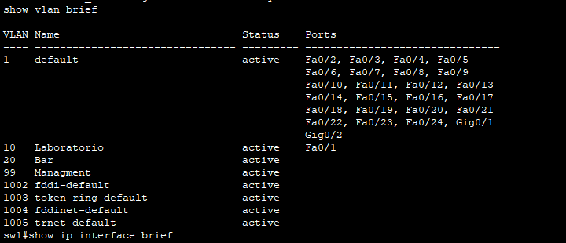
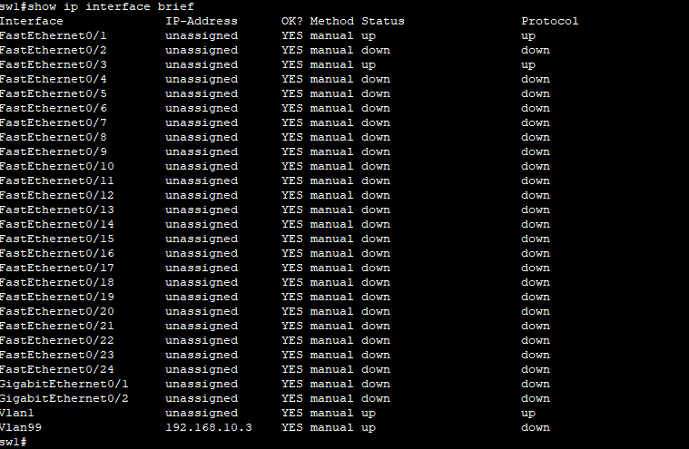
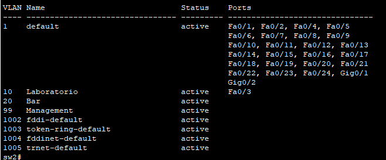
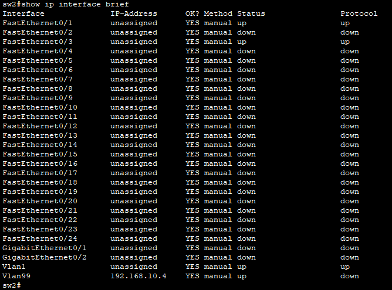
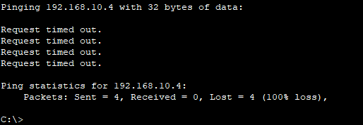
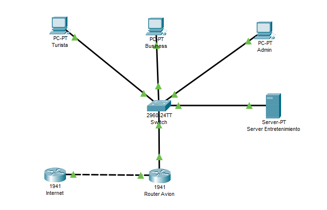
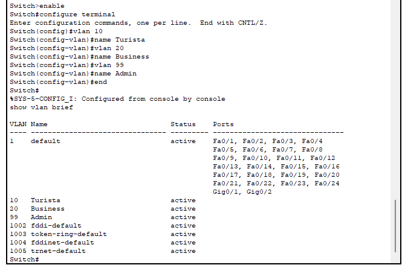
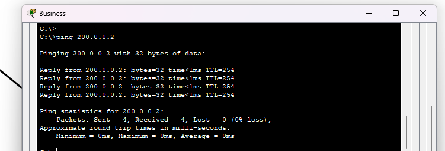
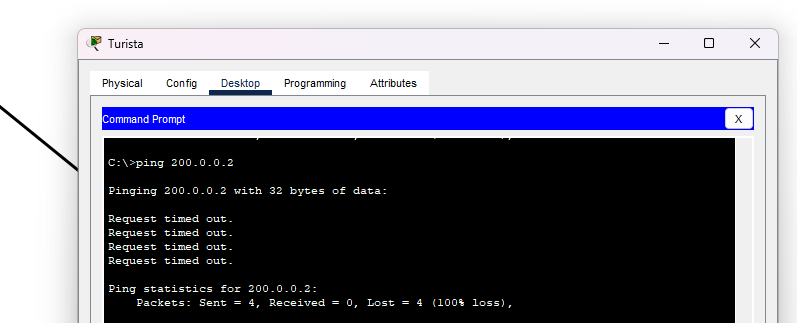
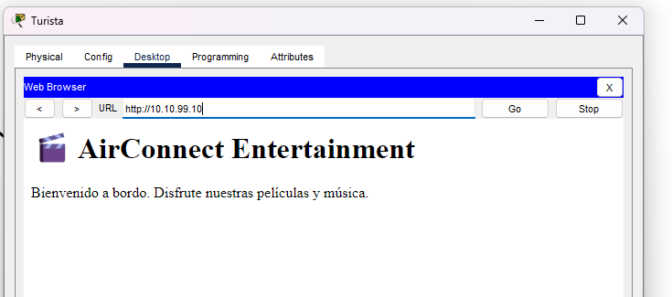

# Capas de Acceso en Redes Locales, Protocolos y Fundamentos

#### **Nombres**

- _Francisco Gomez Neimann_

- _Martina Juri_

- _Maria Wanda Molina_

- _Marcos Morán_

#### **Nombre del grupo**

WAN_da

#### **Nombre del centro educativo o institución**

Facultad de Ciencias Exactas, Físicas y Naturales

#### **Nombre del curso o materia**

Comunicaciones de Datos

#### **Profesores**

Santiago M. Henn

#### **Fecha**

3 de noviembre de 2025

---

### Información de los autores

- **Información de contacto**:

  _francisco.gomez.neimann@mi.unc.edu.ar_

  _martina.juri@mi.unc.edu.ar_

  _wanda.molina@mi.unc.edu.ar_

  _mmoran@mi.unc.edu.ar_

---
## Resumen

El presente trabajo se enfoca en los fundamentos de protocolos y las capas de acceso en redes locales, teniendo como objetivo principal la comprensión de la diferenciación de tipos de redes y la implementación de configuraciones avanzadas. El informe requiere una investigación teórica sobre el alcance de las redes y la virtualización, abarcando la definición y clasificación de las VLANs (Redes de Área Local Virtual), el resumen del protocolo IEEE 802.1Q y su relación con el concepto de Tagging.
La parte práctica exige la implementación de una topología de red específica utilizando la herramienta Packet Tracer, la cual es un programa flexible diseñado para simular y probar redes. La implementación debe incluir un esquema de direccionamiento IPv4 que contemple la división en subredes (subnetting) y la configuración de varias VLANs con distintos niveles de acceso.
Finalmente, el trabajo se valida mediante la realización de pruebas que confirmen la conectividad utilizando comandos como ping y verificaciones de acceso HTTP, documentando el diagrama de red, las capturas de pantalla y las conclusiones en el informe final.

## Introducción

Se aborda el estudio de los fundamentos de protocolos y las capas de acceso en redes locales, con un enfoque teórico y práctico en la segmentación eficiente de las infraestructuras de comunicación. Este trabajo se centra en tres pilares conceptuales fundamentales para el diseño de redes modernas: la virtualización de la capa de enlace, la segmentación lógica del direccionamiento IPv4 y la implementación de políticas de seguridad.
### Virtualización y Estándares de Capa 2
El trabajo se enmarca en la necesidad de clasificar las redes según su alcance (como las Redes de Área Local o LAN, y las Redes de Área Amplia o WAN) y profundizar en el concepto de virtualización. Central a este estudio es la VLAN (Red de Área Local Virtual), que permite segmentar lógicamente una red física.
Para que esta segmentación virtual funcione, se requiere el protocolo IEEE 802.1Q, que establece un método de Tagging (etiquetado). El estándar 802.1Q logra esto al inyectar una etiqueta VLAN de cuatro bytes en la cabecera del frame Ethernet. Esta etiqueta es crucial, ya que porta la identidad de la VLAN a la que pertenece la trama. El mecanismo de etiquetado ocurre en el switch al enviar la trama a través de un enlace troncal (VLAN trunk), y la etiqueta es removida al recibirla en el switch destino. Dicha etiqueta incluye un campo de identificador VLAN de 12 bits, lo que permite la configuración de hasta 4096 VLANs en la red.
### Segmentación de Red y Direccionamiento Lógico (IPv4)
Otro componente teórico esencial es el direccionamiento IPv4, ya que todavía hay muchas redes que lo utilizan. El objetivo del informe es calcular un esquema de división en subredes (subnetting) para segmentar la red de manera eficiente.
La división en subredes, descrita figurativamente como "cortar un pastel en trozos cada vez más pequeños", es una aptitud fundamental para cualquier administrador de red. Este proceso permite que una dirección IPv4, que se compone de una porción de red y una porción de host, se divida en segmentos más pequeños para permitir una mejor comunicación y administrar los dispositivos de manera efectiva. La identificación de la porción de red se realiza mediante la máscara de subred o la longitud del prefijo (notación de barra [/]).
### Implementación de Políticas y Seguridad
Finalmente, el informe integra estos conceptos en un entorno simulado (Packet Tracer), enfocándose en aplicar políticas de acceso diferenciadas para asegurar una red confiable. La simulación del despliegue de la red exige configurar Listas de Control de Acceso (ACLs) y Traducción de Direcciones de Red (NAT). La necesidad de ACLs y políticas de seguridad radica en la capacidad de la red para permitir o denegar el flujo de datos según parámetros de seguridad y lograr que la infraestructura cumpla con los cuatro requisitos básicos de una red confiable: tolerancia a fallos, escalabilidad, Calidad de Servicio (QoS) y seguridad.

## Resultados

### 1.  Alcance de Redes y Virtualización

Las redes se clasifican según la **extensión geográfica** y el **número de dispositivos conectados**.

| Tipo de red | Alcance aproximado | Características principales | Acrónimo |
|--------------|--------------------|-----------------------------|-----------|
| **PAN** (Personal Area Network) | Hasta 10 m | Conecta dispositivos personales (celulares, auriculares, smartwatch). Usa Bluetooth o USB. | PAN |
| **LAN** (Local Area Network) | Hasta varios cientos de metros (una casa, oficina, escuela) | Alta velocidad, propiedad privada, bajo costo de instalación. | LAN |
| **CAN** (Campus Area Network) | Hasta varios kilómetros (universidad, empresa con varios edificios) | Interconecta varias LAN cercanas. | CAN |
| **MAN** (Metropolitan Area Network) | Hasta 50 km (una ciudad) | Propiedad de proveedores de servicios. | MAN |
| **WAN** (Wide Area Network) | Cobertura nacional o mundial | Conecta redes a gran distancia, como Internet. | WAN |

---

**VLAN (Virtual Local Area Network):**  
Es una red lógica creada dentro de una red física LAN que permite **segmentar** los dispositivos en grupos virtuales, aunque estén conectados al mismo switch físico.  
Esto **mejora la seguridad, el rendimiento y la administración.**

**Clasificación:**
1. **VLAN por puerto (estática):** Se asigna manualmente un puerto del switch a una VLAN.
2. **VLAN dinámica:** Se asigna automáticamente según dirección MAC o políticas.
3. **VLAN por protocolo o subred:** Se define según el protocolo o red IP usada.

---

**Protocolo IEEE 802.1Q y su relación con las VLAN**

El estándar **IEEE 802.1Q** define **cómo se etiquetan las tramas Ethernet** para identificar a qué VLAN pertenecen.  
- Agrega un **campo de 4 bytes (Tag VLAN)** en el encabezado Ethernet.  
- Este campo incluye el **VLAN ID (VID)**, un número de 12 bits que permite hasta **4096 VLANs**.  
- Permite que varios switches compartan el mismo enlace físico (**trunk**) y sigan distinguiendo las VLANs.

---

**¿Qué es el Tagging?**

El **Tagging** (etiquetado) es el proceso de **agregar una etiqueta VLAN (Tag 802.1Q)** a una trama Ethernet.  
- Indica a qué VLAN pertenece la trama.  
- Se usa en los **enlaces troncales (trunk links)** entre switches o routers.  
- El equipo receptor lee el tag y reenvía el tráfico solo dentro de la VLAN correspondiente.

**Tipos de tramas:**
- **Tagged:** Tramas que incluyen el identificador VLAN (usadas en enlaces trunk).  
- **Untagged:** Tramas sin etiqueta (usadas en puertos de acceso o “access ports”).

---

### 2. Configuración de la topología en Packet Tracer

#### Objetivo
Configurar dos switches y dos computadoras dentro de una topología local, aplicando conceptos de VLAN, seguridad y administración, para verificar la conectividad entre los dispositivos.

---

#### Nombrar los switches
Se ingresó al modo de configuración global y se asignaron los nombres:

- **sw1**
- **sw2**

**Comandos utilizados:**

```text
en
conf t
hostname sw1
hostname sw2
```

---

#### Configuración de contraseñas
Se configuraron contraseñas de acceso privilegiado, consola y vty, y se habilitó el cifrado con `service password-encryption`.

**Comandos utilizados:**
```text
enable secret contrasena_exec
line console 0
password contrasena_consola
login
exit

line vty 0 15
password contrasena_vty
login
exit

service password-encryption
```

---

#### Configuración de IPs de administración
Se asignaron las IPs de la tabla de direccionamiento a la interfaz VLAN de cada switch.

| Dispositivo | Interfaz | Dirección IP | Máscara | Gateway |
|--------------|-----------|---------------|----------|----------|
| SW-1 | VLAN 1 | 192.168.1.11 | 255.255.255.0 | N/A |
| SW-2 | VLAN 1 | 192.168.1.12 | 255.255.255.0 | N/A |

**Comandos utilizados:**

```text
interface vlan 1
ip address 192.168.1.11 255.255.255.0
no shutdown
exit
```


Figura 2.1: Asignación de IP a la PC0. Fuente propia. 


Figura 2.2: Asignación de IP a la PC0. Fuente propia.

---
#### Testeo de comunicación entre las computadoras usando ping


Figura 2.3: Ping de PC0 a PC1. Fuente propia.


Figura 2.4: Ping de PC1 a PC0. Fuente propia.

---

#### Creación de VLANs y asignación de puertos

Se crearon tres VLANs y se asignaron nombres descriptivos:

| VLAN | Nombre | Función |
|------|---------|----------|
| 10 | Laboratorio | PCs de prueba |
| 20 | Bar | (no usada en esta práctica) |
| 99 | Management | Administración del switch |

**Comandos utilizados:**

```text
vlan 10
name Laboratorio
vlan 20
name Bar
vlan 99
name Management
end
```

Se ejecutar `show vlan brief` y se muestra la lista de VLANs creadas (con sus nombres y puertos asociados).


Figura 2.5: VLAN por defecto en SW0. Fuente propia.


Figura 2.6: VLAN por defecto en SW1. Fuente propia.

Por defecto, todos los puertos están asignados a la VLAN 1.

---

#### Asignación de puertos a VLANs
**PC-0** fue conectada al puerto **F0/1** de **sw1**, y **PC-1** al puerto **F0/3** de **sw2**, ambos dentro de la VLAN 10.

**Comandos utilizados:**

```text
interface f0/x
switchport mode access
switchport access vlan 10
```



Figura 2.7: Asignacion de puerto F0/1. Fuente propia.


Figura 2.8: Asignacion de puerto F0/3. Fuente propia.

---

#### Reasignación de IP de administración a VLAN 99
Se migró la dirección de administración desde la VLAN 1 a la VLAN 99, configurada como “Management”.

**Comandos utilizados:**

```text
interface vlan 1
no ip address
interface vlan 99
ip address 192.168.1.11 255.255.255.0
no shutdown
exit
```

Se ejecuta `show ip interface brief` para mostrar que la IP de gestión ahora se encuentra en VLAN 99.

### Switch 1


Figura 2.9: IP de gestión configurada en la VLAN 99. Fuente propia.



Figura 2.10: La interfaz VLAN 99 en estado "down" (no operativa). Fuente propia.

### Switch 2



Figura 2.11: IP de gestión configurada en la VLAN 99. Fuente propia.



Figura 2.12: La interfaz VLAN 99 en estado "down" (no operativa). Fuente propia.

---

#### Verificación de conectividad
Desde **PC-A** y **PC-B** se realizaron pruebas de ping entre sí.

Pings desde PC0 A PC1 y viceversa.



Figura 2.13: Ping desde PC1 a PC2. Fuente propia.


Figura 2.14: Ping desde PC2 a PC1. Fuente propia.

---
### 3. Despliegue de una red LAN en un avión
En este punto se configuró la red correspondiente al avión, compuesta por un router principal, un switch, tres computadoras (Turista, Business y Administración), un servidor de entretenimiento y un router adicional que simula el proveedor de Internet (ISP).  
El objetivo fue segmentar el tráfico mediante VLANs, permitir el acceso a Internet únicamente a los pasajeros Business y a la Administración, y restringir a la clase Turista para que solo acceda al servidor local.

---

#### Conexión física de los dispositivos

Se colocaron los siguientes equipos en el área de trabajo de Packet Tracer:

- Router del avión  
- Router “Internet” (ISP)  
- Switch 2960  
- Tres PCs (Turista, Business, Administración)  
- Servidor de entretenimiento  

Se conectaron utilizando los cables apropiados:  
- **Cables directos** para conexiones Router–Switch y PC–Switch.  
- **Cable cruzado** entre el Router del avión y el Router Internet.



Figura 3.1: Topología completa con las conexiones realizadas. Fuente propia.

---

#### Activación de interfaces

En el Router del avión se activaron las interfaces FastEthernet 0/0 y FastEthernet 0/1:

```text
enable
configure terminal
interface fa0/0
no shutdown
exit
interface fa0/1
no shutdown
exit
end
```

En el Router Internet también se activó la interfaz Fa0/0:

```text
enable
configure terminal
interface fa0/0
no shutdown
exit
end
```
---

#### Configuración de direcciones IP

Se configuraron las direcciones IP correspondientes a cada enlace de red, de acuerdo con el esquema de direccionamiento asignado.  
El Router Avión utilizó subinterfaces para gestionar las VLANs Turista (10), Business (20) y Administración (99).

| Dispositivo | Interfaz | Dirección IP | Máscara |
|--------------|-----------|--------------|----------|
| Router Avión | Fa0/0.10 | 10.10.10.1 | 255.255.255.0 |
| Router Avión | Fa0/0.20 | 10.10.20.1 | 255.255.255.0 |
| Router Avión | Fa0/0.99 | 10.10.99.1 | 255.255.255.0 |
| Router Avión | Fa0/1 | 200.0.0.1 | 255.255.255.252 |
| Router Internet | Fa0/0 | 200.0.0.2 | 255.255.255.252 |

---

#### Configuración del switch y VLANs

En el switch se crearon tres VLANs con los nombres indicados:

```text
enable
configure terminal
vlan 10
name Turista
vlan 20
name Business
vlan 99
name Administracion
```

Luego se asignaron los puertos a cada VLAN según las PCs conectadas y se configuró el enlace hacia el router como **trunk**:

```text
interface range f0/2 - 3
switchport mode access
switchport access vlan 10
exit
interface range f0/4 - 5
switchport mode access
switchport access vlan 20
exit
interface range f0/6 - 7
switchport mode access
switchport access vlan 99
exit
interface f0/1
switchport mode trunk
exit
```



Figura 3.2: VLANs creadas y puertos asignados. Fuente propia.


---

#### Configuración del servidor DHCP

Se configuró el servicio DHCP en el Router Avión para que las PCs de cada VLAN obtuvieran una dirección IP automáticamente:

```text
ip dhcp excluded-address 10.10.10.1 10.10.10.10
ip dhcp excluded-address 10.10.20.1 10.10.20.10
ip dhcp excluded-address 10.10.99.1 10.10.99.10

ip dhcp pool Turista
network 10.10.10.0 255.255.255.0
default-router 10.10.10.1
dns-server 10.10.99.10

ip dhcp pool Business
network 10.10.20.0 255.255.255.0
default-router 10.10.20.1
dns-server 8.8.8.8

ip dhcp pool Admin
network 10.10.99.0 255.255.255.0
default-router 10.10.99.1
dns-server 8.8.8.8
```

---

#### Configuración de NAT y ACLs

Se habilitó la traducción de direcciones (NAT) solo para la VLAN Business, permitiendo su salida a Internet a través del Router ISP.  
También se creó una lista de control de acceso (ACL) para **bloquear el acceso a Internet de la VLAN Turista** pero permitir el acceso al servidor local.

**Configuración de NAT:**
```text
access-list 20 permit 10.10.20.0 0.0.0.255
ip nat inside source list 20 interface fa0/1 overload
```

**Configuración de ACL:**
```text
access-list 100 deny ip 10.10.10.0 0.0.0.255 any
access-list 100 permit ip any any
interface fa0/0.10
ip access-group 100 out
```

---

#### Configuración del servidor de entretenimiento

En el servidor se configuró una IP estática:
- IP: 10.10.99.10  
- Máscara: 255.255.255.0  
- Gateway: 10.10.99.1  

Se activó el servicio **HTTP** y se cargó una página HTML con contenido de prueba.

---

#### Pruebas de conectividad

Desde las PCs se realizaron pruebas con los siguientes resultados esperados:

| Origen | Destino | Resultado esperado |
|--------|----------|--------------------|
| PC Turista | Servidor (10.10.99.10) | ✅ Conectividad y acceso HTTP |
| PC Turista | Internet (8.8.8.8) | ❌ Bloqueado por ACL |
| PC Business | Servidor (10.10.99.10) | ✅ Conectividad |
| PC Business | Internet (8.8.8.8) | ✅ Acceso exitoso por NAT |
| PC Admin | Todas las VLAN | ✅ Acceso total |



Figura 3.3: Ping de prueba entre Business a Internet. Fuente propia



Figura 3.4: Ping de prueba entre Turista a Internet. Fuente propia



Figura 3.5: Configuración del servidor HTTP y página cargada. Fuente propia

---

#### Conclusión
Al finalizar la configuración de la topología, se verificó que las computadoras no lograron establecer conectividad mediante ping entre sí ni con los switches. Este resultado es coherente con la etapa del trabajo, ya que hasta este punto solo se configuraron las VLANs y las IPs de administración, sin implementar ningún mecanismo de interconexión entre ellas.

Cada dispositivo pertenece a una subred diferente y los switches operan únicamente en capa 2, lo que impide el enrutamiento entre VLANs. Además, no se configuraron enlaces trunk ni un router que permita la comunicación entre redes. Por este motivo, los paquetes ICMP no encuentran un camino válido hacia el destino, lo que confirma que el aislamiento entre las VLANs está funcionando correctamente.

En conclusión, la ausencia de respuesta en las pruebas de ping valida la segmentación lógica realizada y demuestra que las VLANs se encuentran correctamente configuradas, quedando pendiente la incorporación del enrutamiento o trunking en etapas posteriores para lograr la conectividad completa entre los dispositivos.
