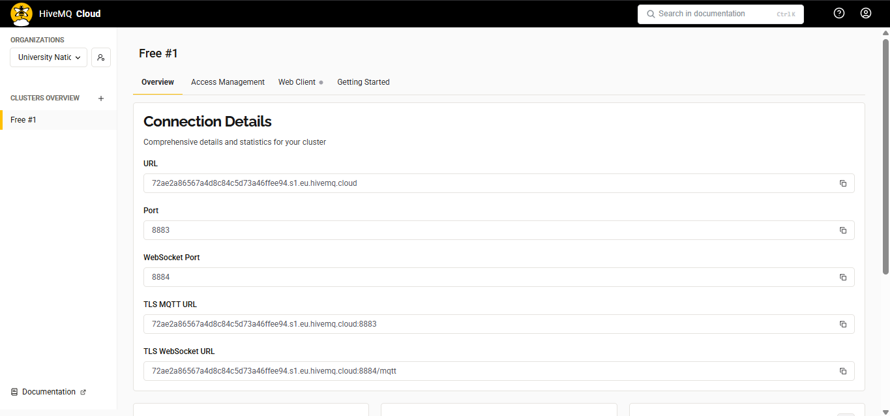
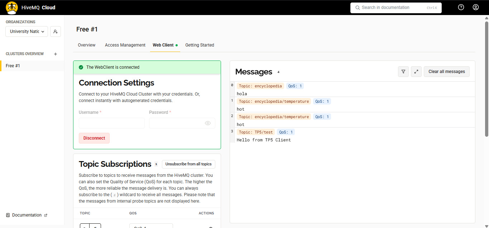

# Simulación de una Red Local utilizando MQTT

#### **Nombres**

- _Francisco Gomez Neimann_

- _Martina Juri_

- _Maria Wanda Molina_

- _Marcos Morán_

#### **Nombre del grupo**

WAN_da

#### **Nombre del centro educativo o institución**

Facultad de Ciencias Exactas, Físicas y Naturales

#### **Nombre del curso o materia**

Comunicaciones de Datos

#### **Profesores**

Santiago M. Henn

#### **Fecha**

10 de noviembre de 2025

---

### Información de los autores

- **Información de contacto**:

  _francisco.gomez.neimann@mi.unc.edu.ar_

  _martina.juri@mi.unc.edu.ar_

  _wanda.molina@mi.unc.edu.ar_

  _mmoran@mi.unc.edu.ar_

---
## Resumen

El presente trabajo se enfoca en los fundamentos de los protocolos de mensajería ligera y los modelos de comunicación en redes locales, teniendo como objetivo principal la comprensión del protocolo MQTT y del patrón de diseño Publish/Subscribe, así como su diferenciación respecto del modelo tradicional cliente–servidor.
La parte práctica pide la implementación y puesta en marcha de un broker MQTT, ya sea en forma local o cloud-based (por ejemplo, HiveMQ, Mosquitto o EMQX), y la configuración de múltiples clientes que simulan nodos de una red local. Sobre esta base se desarrolla una topología lógica de comunicación que incluye: la simulación de un enlace punto a punto entre dos dispositivos mediante un tópico específico, la configuración de tópicos de broadcasting para difundir mensajes a varios clientes de manera simultánea y el diseño de una jerarquía de tópicos que representa sensores de distintas salas, con generación de datos simulados y su posterior recolección por una gateway o servidor central.
Finalmente, el trabajo se valida mediante la realización de pruebas que confirman el correcto intercambio de mensajes entre los distintos clientes MQTT, la recepción adecuada de los broadcasts y la agregación de datos de sensores en el cliente central. Además, se complementa con la captura y análisis de paquetes mediante un sniffer de red para observar la estructura de los mensajes MQTT sobre la capa de transporte, y con una reflexión sobre la integridad, confidencialidad y disponibilidad de la arquitectura, el impacto de los niveles de QoS y las ventajas y limitaciones del modelo Publish/Subscribe frente a una red LAN tradicional. Todos estos resultados se documentan mediante diagramas, capturas de pantalla y conclusiones en el informe final.

## Introducción

En el contexto actual de las comunicaciones de datos, el crecimiento de las aplicaciones de Internet de las Cosas (IoT) y de los sistemas distribuidos ha impulsado el uso de protocolos ligeros que permitan interconectar gran cantidad de dispositivos con recursos limitados. En este escenario, los protocolos de mensajería orientados a eventos adquieren un rol central, ya que ofrecen mecanismos eficientes para el intercambio de información entre sensores, actuadores y servicios de procesamiento, manteniendo un consumo acotado de ancho de banda y energía. Dentro de este conjunto de tecnologías, el protocolo MQTT se ha consolidado como una de las alternativas más utilizadas para la comunicación en redes locales y arquitecturas IoT basadas en el paradigma Publish/Subscribe.
En nuestro trabajo se propone el diseño y la simulación de una red local en la que diversos clientes MQTT actúan como nodos de una infraestructura típica de IoT, mientras que un broker central coordina el envío y la recepción de mensajes a través de tópicos jerárquicos. De este modo, se busca comprender cómo el modelo Publish/Subscribe permite desacoplar emisores y receptores, facilitando la escalabilidad y la modularidad de la solución.
A partir de esta implementación, el trabajo permite explorar diferentes patrones de comunicación, tales como el intercambio punto a punto mediante tópicos específicos, la difusión de mensajes a múltiples clientes utilizando tópicos de difusión y la organización lógica de sensores distribuidos por medio de una jerarquía de tópicos. Además, se fomenta la reflexión sobre aspectos de calidad de servicio, integridad y disponibilidad de los mensajes, así como sobre las implicancias que tiene la centralización del tráfico en el broker en términos de rendimiento y tolerancia a fallas.

## Resultados

### 1.  Resumir brevemente las características del protocolo MQTT. Incluir ventajas, desventajas y principales usos. 

El protocolo MQTT (Message Queuing Telemetry Transport) es un protocolo de mensajería ligero, orientado a la comunicación máquina-a-máquina y al Internet de las Cosas (IoT). Está diseñado para funcionar sobre redes con recursos limitados, tanto en términos de ancho de banda como de capacidad de procesamiento de los dispositivos finales. MQTT se apoya típicamente en TCP como protocolo de transporte, lo que le permite asegurar una entrega ordenada de los mensajes y facilitar distintos niveles de calidad de servicio.

Una característica central de MQTT es que se basa en un modelo de comunicación **desacoplado** mediante un **broker** o **intermediario**. Los dispositivos no se comunican directamente entre sí, sino que se conectan al broker y envían o reciben mensajes a través de él. Esto permite que los emisores de información y los receptores no necesiten conocer sus direcciones ni mantener conexiones punto a punto, lo cual simplifica la escalabilidad en escenarios con muchos nodos.

**Ventajas:** 

* **Bajo overhead**, que lo hace adecuado para enlaces con poco ancho de banda o alta latencia. 

* **Capacidad para manejar gran cantidad de dispositivos conectados de forma simultánea.** 

* **Niveles de QoS (Quality of Service)**, que permiten ajustar el compromiso entre fiabilidad y consumo de recursos. 

* **Estructura de tópicos jerárquicos**, que facilita la organización lógica de los mensajes y habilita mecanismos de filtrado y routing mediante comodines.

**Desventajas:** 

* Al depender de un broker central se introduce un punto único de falla que puede afectar la disponibilidad del sistema si no se implementan mecanismos de redundancia.

* No define de forma nativa mecanismos fuertes de **seguridad**. 

* Al ser un protocolo pensado para mensajería ligera, puede no ser la mejor opción cuando se requiere transferencia de grandes volúmenes de datos o funcionalidades más complejas propias de otros protocolos de aplicación.

Los **principales usos** de MQTT se encuentran en sistemas de **telemetría**, domótica, monitoreo de sensores en tiempo real, control de dispositivos IoT, aplicaciones industriales y, en general, en cualquier escenario donde un conjunto de nodos distribuya o consuma datos de estado de manera frecuente pero con mensajes pequeños. Es habitual verlo en redes locales de dispositivos inteligentes y en soluciones en la nube que recolectan datos desde múltiples ubicaciones.

### Responder: ¿Qué es el patrón de diseño PubSub?.

En este contexto, el patrón de diseño PubSub es el modelo lógico sobre el cual se construye MQTT. En PubSub se distinguen dos roles conceptuales: los **publicadores** (publishers), que emiten mensajes asociados a uno o varios tópicos, y los **suscriptores** (subscribers), que expresan interés en ciertos tópicos y reciben los mensajes vinculados a ellos. Entre ambos se ubica el **broker**, que actúa como intermediario encargado de recibir los mensajes publicados, clasificarlos según el tópico y entregarlos a todos los clientes que estén suscriptos a dichos tópicos. Este patrón introduce un fuerte desacoplamiento **espacial** (los nodos no necesitan conocerse entre sí), **temporal** (no es necesario que publicador y suscriptor estén conectados exactamente al mismo tiempo, dependiendo de la configuración) y de **sincronización**, lo que favorece la escalabilidad y la flexibilidad de la arquitectura de comunicaciones.

### 2. Instalar/desplegar y ejecutar un broker MQTT.

Nosotros decidimos utilizar HiveMQ Cloud para desplegar nuestro broker MQTT. HiveMQ Cloud es una solución de broker MQTT gestionada en la nube que ofrece alta disponibilidad, escalabilidad y seguridad, lo que la hace ideal para proyectos de IoT y aplicaciones distribuidas.

Figura 1: Interfaz de HiveMQ Cloud.

### 3. Verificar que el broker funciona, suscribiendose con un cliente

Utilizando los tutoriales proporcionados por HiveMQ, creamos un cliente MQTT en Python utilizando la librería Paho-MQTT. Configuramos el cliente para conectarse al broker de HiveMQ Cloud, suscribiéndonos a un topico llamado encyclopedia y otro llamado TP5, enviamos un mensaje "hot" en "encyclopedia/temperature" y otro mensaje "Hello from TP5 Client" en "TP5/test".

Figura 2: Mensajes recibidos en el cliente MQTT.
 